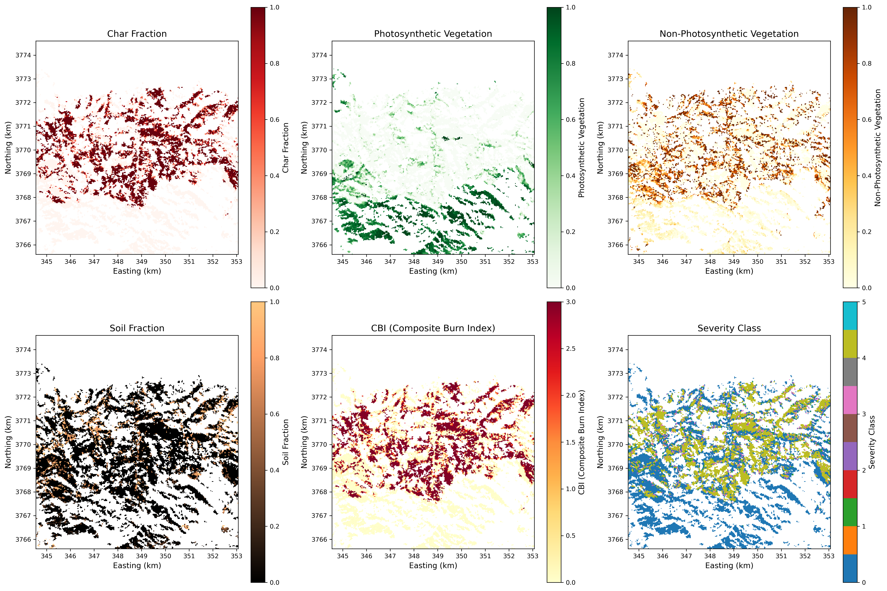
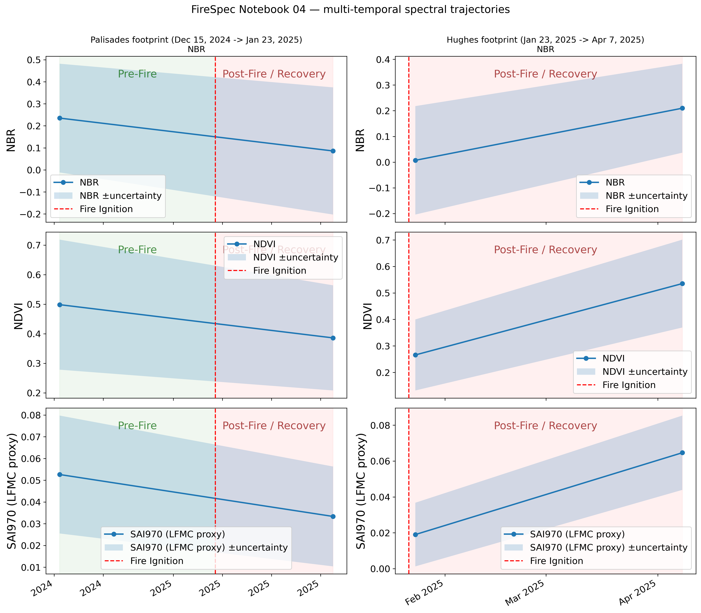
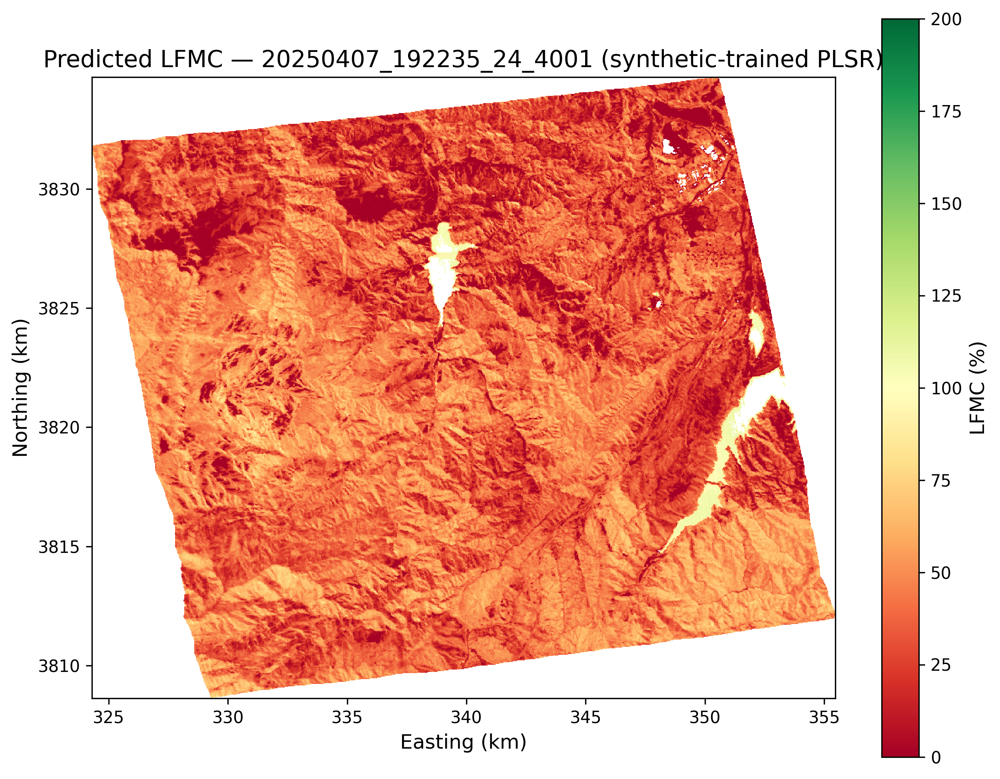

# FireSpec

**Hyperspectral wildfire analysis for Planet Tanager-1 imagery — burn severity mapping and live
fuel moisture estimation for the 2025 LA wildfires.**

[](https://www.python.org/)
[](LICENSE)
[](tests/)

FireSpec is an open-source Python toolkit built for the [Planet Tanager Open Data
Competition](#competition). It turns Tanager-1's 426-band hyperspectral imagery (380–2500 nm,
30 m GSD) into operational wildfire products: MESMA-based burn severity (CBI/BARC), live fuel
moisture content (LFMC), multi-temporal recovery trajectories, and cross-sensor comparisons
against EMIT, PRISMA, and Sentinel-2 — using the 2025 LA wildfires as the case study.

---

## Results at a Glance

> Figures below are generated by the notebooks in [`notebooks/`](notebooks/) and exported to
> `figures/`. Run `make notebooks && make figures` (or execute the notebooks directly) to
> populate them locally.

| Burn Severity | Temporal Recovery |
| --- | --- |
|  |  |
| MESMA-derived CBI / BARC severity classification over the Palisades/Eaton burn scar | NBR/NDVI/LFMC recovery trajectory across 7 Tanager acquisitions, Dec 2024 – Sep 2025 |

| Live Fuel Moisture |
| --- |
|  |
| PLSR-estimated live fuel moisture content (%) from hyperspectral water-absorption indices |

See [`notebooks/05-sensor-comparison.ipynb`](notebooks/05-sensor-comparison.ipynb) for
quantified improvement ratios of Tanager's 426 bands vs. coarser multispectral/hyperspectral
sensors, and [`docs/technical-memo.md`](docs/technical-memo.md) for the full write-up.

---

## Installation

```bash
git clone https://github.com/gpriceless/tanager_fire.git
cd tanager_fire
pip install -e .
```

Optional extras:

```bash
# Development tooling (pytest, ruff, mypy)
pip install -e ".[dev]"

# Jupyter notebook suite (jupyter, nbformat)
pip install -e ".[notebook]"

# Everything
pip install -e ".[dev,notebook]"
```

Requires **Python 3.10+** (CI runs on 3.12). MESMA spectral unmixing needs the optional
`mesma` extra: `pip install -e ".[mesma]"`.

### Data

Tanager-1 scenes are accessed via Planet's public STAC catalog — **no authentication required**:

```python
import tanager
scenes = tanager.list_fire_scenes()          # browse the fire collection
tanager.download_scene(scenes[0], "data/raw/fire/")
```

A small set of reference scenes covering the LA wildfires (pre-fire, immediate post-fire, and
recovery timepoints) ships under `data/raw/fire/` for quick experimentation; the full time
series is fetched on demand through the STAC catalog above.

---

## Quickstart

```python
import tanager

scenes = tanager.list_fire_scenes()
ds = tanager.load_ortho_scene("data/raw/fire/20250123_185507_64_4001_ortho_sr_hdf5.h5")
nbr = tanager.nbr(ds)
tanager.plot_map(nbr, product_name="nbr")
```

This loads a post-fire ortho-rectified surface reflectance scene, computes the Normalized Burn
Ratio, and renders a georeferenced map. See [`docs/api-reference.md`](docs/api-reference.md)
for the full public API, or the notebooks below for end-to-end workflows (severity mapping,
LFMC estimation, temporal trajectories, sensor comparison).

---

## Notebooks

| Notebook | Description |
| --- | --- |
| [`01-data-discovery.ipynb`](notebooks/01-data-discovery.ipynb) | STAC catalog traversal and scene inventory — discovering and cataloging the LA wildfire time series |
| [`02-burn-severity.ipynb`](notebooks/02-burn-severity.ipynb) | MESMA spectral unmixing and CBI/BARC burn severity estimation, validated against USGS BARC maps |
| [`03-fuel-moisture.ipynb`](notebooks/03-fuel-moisture.ipynb) | LFMC estimation via spectral water indices (SAI, continuum removal) and PLSR regression |
| [`04-temporal-recovery.ipynb`](notebooks/04-temporal-recovery.ipynb) | Multi-temporal vegetation recovery trajectories across 7 Tanager acquisitions |
| [`05-sensor-comparison.ipynb`](notebooks/05-sensor-comparison.ipynb) | Tanager-1 vs EMIT / PRISMA / Sentinel-2 spectral degradation and information-loss analysis |

Notebooks ship with pre-computed outputs. To reproduce from scratch:

```bash
make install     # pip install -e ".[dev,notebook]"
make notebooks    # jupyter nbconvert --execute notebooks/*.ipynb
make figures      # export publication figures to figures/
```

---

## API Reference

Full public API — function signatures, parameters, and usage examples for all modules
(`config`, `catalog`, `io`, `spectral`, `masks`, `endmembers`, `unmixing`, `severity`, `lfmc`,
`validation`, `visualization`) — is documented in [`docs/api-reference.md`](docs/api-reference.md).

---

## Competition

Built for the [Planet Tanager Open Data
Competition](https://www.planet.com/pulse/announcing-the-tanager-open-data-competition/)
(deadline **August 31, 2026**), submitted under the **Code & Scripts** track.

---

## Citation

If you use FireSpec in your work, please cite it (see [`CITATION.cff`](CITATION.cff)):

```bibtex
@software{price_firespec_2026,
  author  = {Price, Gabriel},
  title   = {{FireSpec}: Hyperspectral Wildfire Analysis for Planet Tanager-1 Imagery},
  year    = {2026},
  url     = {https://github.com/gpriceless/tanager_fire},
  license = {MIT}
}
```

---

## License

Released under the [MIT License](LICENSE).
